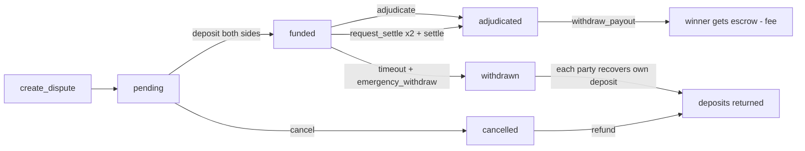

<div align="center">

# DisputeArbiter

### Trustless AI Arbitration on GenLayer — verifiable evidence, consensus-backed verdicts, on-chain payouts

[](https://docs.genlayer.com)
[](https://www.python.org)
[](https://docs.genlayer.com/developers/intelligent-contracts/tooling-setup)
[](https://explorer-studio.genlayer.com/address/0xCB95BF5A863AbCF7779920975DaBeca55Cf31dBC)
[](LICENSE)

Two parties (or two AI agents) deposit a symmetric escrow, commit their evidence
(URL + sha256 content hash), and let a **network of independent AI validators**
adjudicate the dispute. The verdict, the reasoning and the cited evidence are
recorded on-chain, and the escrow is released to the winner — no courts, no
oracles, no single-model judgment.

</div>

---

## Why GenLayer?

GenLayer positions itself as the **adjudication layer** for the agentic economy:
Bitcoin reached consensus on money, Ethereum on computation, GenLayer on
**meaning**. This contract is the flagship use case — a dispute where the money
is already on-chain and the disagreement needs judgment, not just code. The
Equivalence Principle lets validators agree that two *different-looking* answers
are *equivalent*, so a verdict is only recorded when independent AI validators
concur.

---

## How it works

### The lifecycle



| Stage | What happens | Guards |
|---|---|---|
| **pending** | Claimant opens a dispute: subject, both statements, an adjudication **rule**, and **evidence commitments** (URL + sha256 of its exact content). | distinct parties; valid evidence (max 4/party, no duplicates, no shared URLs); `deposit > 0`; `fee ≤ 10%` |
| **funding** | Each party calls `deposit` (payable) up to `required_deposit`. | only the two parties; capped per side; zero-value rejected |
| **funded** | Auto once both sides have fully paid. | escrow is **binding** during the active window — no unilateral walk-away |
| **adjudicated** | `adjudicate` runs AI consensus (below); or both parties `request_settle` then `settle`. | verdicts below confidence 60 are **not** binding; an agreed settlement blocks unilateral adjudication |
| **payout** | Winner calls `withdraw_payout` (pull-based). | winner only, once per party |
| **cancelled** | Either party backs out while still pending. | refunds return exactly what was deposited |
| **withdrawn** | **`emergency_withdraw`** — after `recovery_timeout` (default 30 days) from funding, either party can unilaterally recover their own deposit. | the **safe escape hatch**: escrow can never be locked forever if adjudication is inconclusive and the other party refuses settlement; once a party exits, adjudication/settlement are blocked |

### The consensus step (Equivalence Principle)

`adjudicate` delegates to a leader/validator pair (`gl.vm.run_nondet_unsafe`):

1. **Leader** fetches each evidence URL, re-hashes the bytes, and only accepts
   content that **matches the committed hash** (tampered content is flagged and
   excluded). It builds a prompt (statements + rule + verified evidence +
   prompt-injection notice) and asks the LLM for strict JSON.
2. **Validators do not trust the leader.** Each independently:
   - rejects errored results and verdicts below `MIN_CONFIDENCE` (60),
   - **re-runs the adjudication** and requires the `verdict` to match exactly,
   - bounds subjective `confidence` drift to ±20,
   - requires every cited URL to be one it independently verified against its
     committed content hash (rejects hallucinated *and* tampered citations),
   - enforces the JSON schema (verdict ∈ {claimant, respondent, split}).

Only the leader result that a validator majority accepts is stored on-chain. If
the accepted verdict is still low-confidence, `adjudicate` reverts with **no
state change** — the dispute stays funded and can be retried or settled.

### Payout math (deterministic)

```
total = claimant_deposit + respondent_deposit
fee   = total * fee_bps / 10000      # capped at 10%
net   = total - fee

"claimant"   -> claimant gets net, respondent 0
"respondent" -> respondent gets net, claimant 0
"split"      -> each gets net/2
mutual settle-> each gets total/2, fee = 0
```

---

## Compare

| | Traditional escrow | Single LLM / oracle | Centralized platform | **DisputeArbiter** |
|---|---|---|---|---|
| **Judgment on-chain** | None — code only | Yes, but one point of judgment | Off-chain, centralized | Decentralized AI-validator consensus |
| **Who decides** | Pre-written code | One model / operator | Company or court | Independent validator majority (Equivalence Principle) |
| **Evidence integrity** | n/a | Whatever the oracle reports | Platform-controlled | Content-pinned (sha256) — tampering is detected & excluded |
| **Ambiguous cases** | n/a (no judgment) | The model guesses anyway | Slow human backlog / discretion | Low-confidence verdicts are **not binding**; mutual settlement |
| **Funds custody** | On-chain escrow | On-chain, oracle-controlled release | Platform holds the funds | On-chain escrow, pull-based payouts |
| **Fee risk** | n/a | Up to the operator | Platform policy | Hard cap at 10% |
| **Payout fairness** | Deterministic | Model decides | Platform decides | Deterministic math once the verdict is accepted; fee capped |

---

## Quick start

```python
import hashlib, json

claim_evidence = json.dumps([{
    "url": "https://example.com/proof.txt",
    "hash": hashlib.sha256(CLAIM_BODY).hexdigest(),   # commit to the exact bytes
}])

contract.create_dispute(
    respondent=bob.address,
    subject="Freelance payment for the landing page",
    claimant_statement="Delivered per the specification.",
    respondent_statement="Delivered late.",
    rule="Claimant wins if the deliverable matched the spec on time.",
    claimant_evidence=claim_evidence,
    respondent_evidence=json.dumps([{"url": "https://example.com/rebuttal.txt", "hash": ...}]),
    required_deposit=1000,
    fee_bps=500,                                        # 5%
)

contract.deposit(dispute_id, value=1000)                # as claimant
contract.deposit(dispute_id, value=1000)                # as respondent

contract.adjudicate(dispute_id)                         # AI consensus (confidence >= 60)
# or, if the case is ambiguous:
# contract.request_settle(dispute_id)  # both parties
# contract.settle(dispute_id)

contract.withdraw_payout(dispute_id)                    # winner pulls funds
contract.withdraw_protocol_fees()                       # owner
```

---

## Public API

| Kind | Methods |
|---|---|
| Write (10) | `create_dispute` · `deposit` (payable) · `cancel` · `refund` · `adjudicate` · `request_settle` · `settle` · `emergency_withdraw` · `withdraw_payout` · `withdraw_protocol_fees` |
| View (6) | `get_dispute` · `get_disputes` · `get_payout_claim` · `get_protocol_fees` · `get_recovery_timeout` · `get_owner` |

---

## Security & threat model

**What the contract defends against**

- **Evidence tampering** — evidence is content-pinned (sha256); it cannot be
  swapped after the other side funds. Duplicate URLs are rejected; a URL cannot
  be claimed by both parties.
- **Prompt injection** — statements and evidence are treated as untrusted data,
  not commands; `[TAMPERED]` evidence is ignored.
- **Hallucination** — leaders may only cite evidence the validators independently
  verified against its committed hash.
- **Ambiguous outcomes** — verdicts below the confidence floor are never binding;
  mutual settlement returns every deposit with **no fee**.
- **No permanent lock** — after `recovery_timeout`, either party can
  `emergency_withdraw` their own deposit unilaterally, so escrow is never trapped
  if adjudication stays inconclusive and the other party refuses to settle.
- **Fund safety** — pull-based, idempotent payouts; binding escrow during the
  active window; fee cap at 10%; owner-only fee withdrawal.

**Honest limits**

- Consensus accuracy rests on GenLayer's validator set (Condorcet's jury theorem)
  — the guarantee is independent AI agreement, not infallibility.
- Content-hash commitments are byte-exact: evidence URLs must return identical
  bytes each time (raw file / IPFS).
- The `rule` is the "law": the claimant writes it, the respondent accepts it by
  funding, and should review it first.

---

## Verification

**69 deterministic unit tests** (`pytest tests/test_dispute_arbiter.py`) cover the full lifecycle,
every verdict path, the validator logic (verdict mismatch, confidence drift,
low-confidence, hallucinated/tampered citations, malformed/errored leaders), and
external-caller tamper resistance.

**Deployed & tested on GenLayer Studio** (real consensus, web and LLM):

- Live contract: [`0xCB95BF5A863AbCF7779920975DaBeca55Cf31dBC`](https://explorer-studio.genlayer.com/address/0xCB95BF5A863AbCF7779920975DaBeca55Cf31dBC)
- Every method exercised end-to-end; **fund transfers confirmed on-chain**
  (winner +1.9M, owner fee +0.1M, refund +1.0M — balances verified, not just tx
  success).
- See `scripts/onchain_test.py`, `scripts/test_deployed.py`,
  `scripts/verify_fund_transfer.py` (in this folder).

---

## Demo (live on studionet)

The deployed contract is a working demo you can inspect and replay:

- **Contract:** [`0xCB95BF5A863AbCF7779920975DaBeca55Cf31dBC`](https://explorer-studio.genlayer.com/address/0xCB95BF5A863AbCF7779920975DaBeca55Cf31dBC)

A real end-to-end run of the **updated** contract (dispute `d0`):

| Step | Dispute | Transaction | Outcome |
|---|---|---|---|
| Create | `d0` | [`0x0602eeda…b46182`](https://explorer-studio.genlayer.com/tx/0xd94260f25b041cc065b7ab34fd04a1e8dd3af52855453eef63f9f2cb873e0bdf) | `pending` |
| Deposit ×2 | `d0` | [`0x18fb853b…3d6e86`](https://explorer-studio.genlayer.com/tx/0x43d5235bae99db0195c1b11f5f213036c981650897329160dc05a31e6bafd931) · [`0x167c0686…1be0f`](https://explorer-studio.genlayer.com/tx/0xcb9108887293e02e86ec732062df7075eb84740dbd79b0fe6ba45d908cea4835) | `funded` (1M wei each) |
| Emergency guard | `d0` | [`0xeddea20c…2f39`](https://explorer-studio.genlayer.com/tx/0x3174aedc0018dfff97a283131839521451963274a0395bfae7ba311bbe5b0d95) | `emergency_withdraw` rejected before the recovery window |
| Adjudicate | `d0` | [`0x3960eed7…ad9db`](https://explorer-studio.genlayer.com/tx/0x6e1de8ad2cada244a0d859d7c47af35d04640cf5009e0ea792184653c821f7af) | verdict `claimant`, confidence 99, payout 1.9M |
| Withdraw | `d0` | [`0xe3793de5…b41573`](https://explorer-studio.genlayer.com/tx/0x4fdc07897d1de231e3b3190a257c6a77a203bf8817343397ded5670c767e6a79) | winner EOA received +1.9M (verified) |
| Settle | `d1` | [`0x6b597010…4ca066`](https://explorer-studio.genlayer.com/tx/0x3310eb0ffb9cefb9155c02dca7fc73d6a95afa4467ab2743ddcb9d8caafe839a) | `split` 1:1, no fee |
| Cancel + refund | `d2` | [`0x2202c50f…2bf34`](https://explorer-studio.genlayer.com/tx/0xf2e34903c8521fe80450c169e7bf24ac7e709fb2009b2b4694db8a2a6efaa036) · [`0xa007d68e…c7c4`](https://explorer-studio.genlayer.com/tx/0x288a811c57f1db1f3d10d04ff743ebafbe35453ed21f327a4545534ba8c10322) | cancelled, deposit returned |

Every hash above is a real, finalized transaction you can open in the explorer.

Replay the demo yourself against the live contract (creates fresh throwaway
parties, no deployer key needed):

```bash
python scripts/test_deployed.py --address 0xCB95BF5A863AbCF7779920975DaBeca55Cf31dBC
```

---

## Development

```bash
pip install -r requirements.txt
genvm-lint check contracts/dispute_arbiter.py   # lint + SDK validation (16 methods)
pytest tests/test_dispute_arbiter.py  # fast in-memory tests (no node)
gltest tests/integration/ -v -s       # end-to-end against a live node
python scripts/onchain_test.py        # deploy + test on studionet
python scripts/test_deployed.py --address <addr>  # re-test an existing contract
```

> **Windows note:** the repo ships a root `conftest.py`, which fixes a
> `genlayer-test` direct-mode temp-file bug on Windows. The long-running `glsim`
> HTTP server also has a statefulness quirk on Windows; fresh processes work
> fine, and Linux / Studio / testnet are unaffected.

---

## Reuse & extension ideas

- **Bounty / escrow adjudication** — "did the contractor deliver?" with on-chain
  payout.
- **Chargebacks** — buyer/seller disputes resolved from shipping/communication
  evidence.
- **Agent-to-agent disputes** — the same escrow for the agentic-commerce stack.
- **Plug a different `rule`** — the adjudication rule is a plain-string
  parameter, so one contract arbitrates many criteria.
- **Build on it** — `adjudicate` is permissionless, so relayers can trigger
  resolution on behalf of the parties.

---

## References

- [GenLayer docs — Equivalence Principle](https://docs.genlayer.com/developers/intelligent-contracts/equivalence-principle)
- [GenLayer docs — Crafting Prompts](https://docs.genlayer.com/developers/intelligent-contracts/crafting-prompts)
- [GenLayer docs — Value Transfers](https://docs.genlayer.com/developers/intelligent-contracts/features/value-transfers)
- [GenLayer docs — Prompt Injection](https://docs.genlayer.com/developers/intelligent-contracts/security-and-best-practices/prompt-injection)
